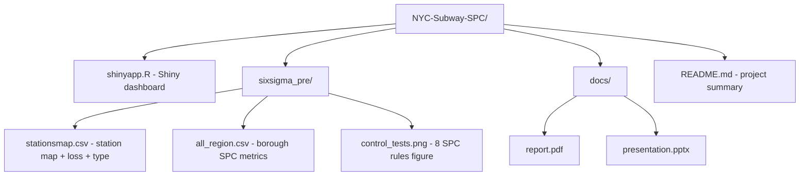
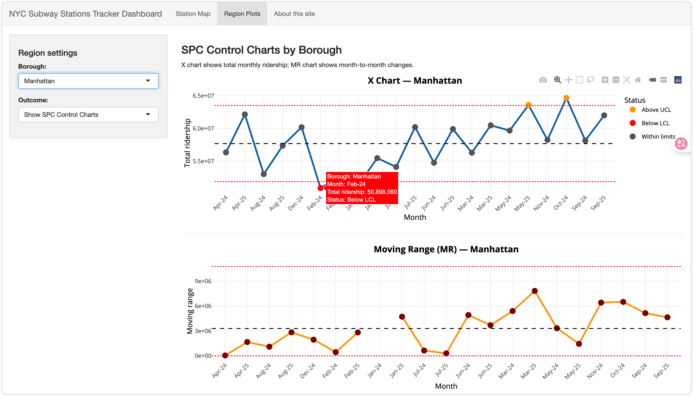

# 🚇 NYC Subway Ridership SPC Dashboard

### 📊 Statistical Process Control Analysis under NYC Congestion Pricing

---

## ✨ Overview

This repository contains an interactive **R Shiny dashboard** analyzing how **NYC subway ridership** changed around the implementation of **Congestion Pricing**.

Using **SPC (Statistical Process Control)** techniques, including **X-charts** and **Moving Range charts**, we detect whether ridership in **Manhattan, Brooklyn, Queens, and the Bronx** shows significant deviations from historical patterns.

The dashboard includes:

* 🗺️ Interactive **subway station map**
* 📈 Borough-level **SPC control charts** (hover-enabled Plotly X chart + MR chart)
* 🚦 Station classification: **Core / Secondary / Stable**
* 💸 Ridership loss and **financial impact estimates**
* 📚 Documentation of assumptions and SPC methodology

---

## 🏙 Project Motivation & Context

NYC’s proposed **congestion pricing** policy is expected to shift travel behavior from private cars to public transit.
Our goals are to:

* Quantify how subway ridership changes by **borough and month**
* Use **SPC** to separate normal random fluctuation from **special-cause variation**
* Identify **priority stations** where ridership shifts translate into large financial impact
* Provide a **visual decision-support tool** for policy discussion and system planning

This dashboard was developed as part of a **Six Sigma / SPC course** in the Cornell Systems Engineering program.

---

## 📂 Repository Structure



---

## 🖥 How to Run the Shiny App

### 1️⃣ Clone or download the repository

```bash
git clone https://github.com/YOUR_GROUP_NAME/YOUR_REPO.git
```

*(Replace `YOUR_GROUP_NAME` and `YOUR_REPO` with your actual GitHub path.)*

### 2️⃣ Install required R packages

```r
install.packages(c(
  "shiny",
  "leaflet",
  "dplyr",
  "readr",
  "scales",
  "ggplot2",
  "plotly"
))
```

### 3️⃣ Run the app in R / RStudio

```r
shiny::runApp("shinyapp.R")
```

Or simply click **“Run App”** in RStudio with `shinyapp.R` open.

---

## 🖼 Dashboard Screenshots

> 把下面的图片路径换成你真实的文件名，比如放在 `docs/` 下面。

### 🗺️ Station Map Tab


### 📈 Region Plots (SPC Charts) Tab



---

## 🌐 Dashboard Features

### 1. 🗺️ Station Map (Borough View)

* Visualizes all subway **station complexes** in the selected borough
* Stations are categorized as:

  * 🔴 **Core** – violates both 2σ and 3σ SPC rules
  * 🟠 **Secondary** – violates 2σ rules only
  * ⚪ **Stable** – no SPC rule violations
* Hover tooltip shows:

  * Station complex name
  * Borough
  * Station type (Core / Secondary / Stable)
  * Estimated loss value

---

### 2. 📈 Borough-Level SPC Charts

The **Region Plots** tab uses `all_region.csv` to build **borough-level time series SPC charts**.

#### 🔹 X-Chart – Total Monthly Ridership

* Y-axis: total monthly ridership for the selected borough
* X-axis: month (e.g., Jan-24, Feb-24, …)
* Center line: mean monthly ridership
* Control limits:

  * `UCL_X` (Upper Control Limit)
  * `LCL_X` (Lower Control Limit)
* Each point is classified as:

  * 🔺 *Above UCL*
  * 🔻 *Below LCL*
  * ⚪ *Within limits*

Plotly hover tooltip shows:

* Borough
* Month
* Total ridership (formatted with commas)
* Status (Above UCL / Below LCL / Within limits)

#### 🔹 MR-Chart – Month-to-Month Change

* **Moving Range** is defined as

  [
  MR_t = |X_t - X_{t-1}|
  ]

* MR-chart shows:

  * MR values over time
  * Mean MR
  * MR control limit

    [
    UCL(MR) = 3.268 \times \overline{MR} \quad (n = 2)
    ]

* Hover tooltip shows:

  * Borough
  * Month
  * Moving range value

---

### 3. 📋 Station List Viewer

In the **Region Plots** tab, switch the outcome to **“Station List”** to:

* Filter by borough
* Select station category:

  * 🔴 Core stations
  * 🟠 Secondary stations
  * ⚪ Stable stations
* View a clean, ordered table of station complexes in that category

This is useful for reporting, prioritization, and communicating results to stakeholders.

---

## 📊 Data & Methodology

### 📁 Data

* **`sixsigma_pre/stationsmap.csv`**

  * One row per **station complex**
  * Example fields:

    * `borough`
    * `station_complex`
    * `priority` (Core / Secondary / Stable)
    * `loss` (estimated ridership / revenue loss)
    * `Longitude`, `Latitude`

* **`sixsigma_pre/all_region.csv`**

  * One row per **borough–month**
  * Example fields:

    * `region` – borough name (Manhattan, Brooklyn, Queens, Bronx)
    * `month` – label like `"Jan-24"`
    * `total_ridership` – total monthly ridership
    * `MR` – moving range
    * `UCL_X`, `LCL_X` – X-chart control limits

### 🧠 SPC Logic (简要)

1. Use historical (pre-policy) data to estimate:

   * Process center (mean ridership)
   * MR-based estimate of variability
2. Construct **2σ** control limits for X-charts from MR estimates.
3. Apply SPC visual rules (see `control_tests.png` for the 8-rule reference).
4. Classify stations based on rule violations:

   * 🔴 **Core** – violates both 2σ and 3σ rules
   * 🟠 **Secondary** – violates only 2σ rules
   * ⚪ **Stable** – no SPC rule violations

### 💰 Loss Estimation

* Compute ridership loss as deviation **below** the lower control limit or baseline
* Convert ridership loss to dollar loss using assumed fare per rider
* Aggregate loss by **borough** and **station type** for summary statistics

---

## 👩‍💻 Authors

* **Luyao Chang – Cornell Systems Engineering ’25**
* **Yueqing Miao – Cornell Systems Engineering ’26**
* **Kegan Lin – Cornell Systems Engineering ’26**
* **Jack Zhou – Cornell Systems Engineering ’26**
* **Laura Liu – Cornell Systems Engineering ’25**

---

## 📜 License

This project is created for **academic coursework and educational purposes** within the Cornell Systems Engineering program.
Please contact the authors if you plan to reuse, extend, or publish results from this work.

---

## 🙌 Acknowledgements

Special thanks to:

* NYC MTA for making ridership data publicly available
* Cornell **Six Sigma / SPC** teaching team for guidance, especially Prof. Tim

* Classmates and reviewers who provided feedback on our dashboard design

