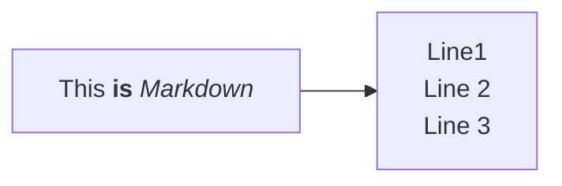

# 5151allabouta
For groupA's project: congesting price in 5151 6sigma (2025)
### Heading 3
mutiple choice
-bullet points
1. lay
2. lazy
3. 
make a code chunck
```r
library(dplyr)
# This is my new code for R
print("hello wellwellwell")
```

### Mermaid diagrams in Github

